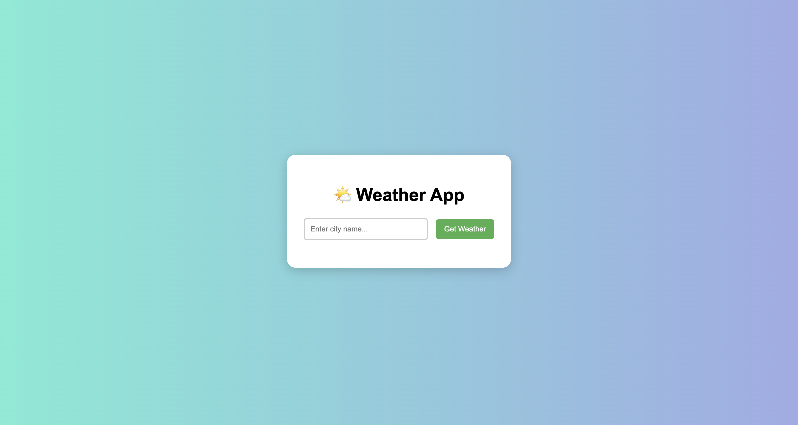

# 🌤️ Weather App

A simple weather application built using **HTML, CSS, and JavaScript** that fetches real-time weather data from [WeatherAPI](https://www.weatherapi.com/).

---

## 🚀 Features
- Search weather by city name  
- Displays:
  - 🌡️ Temperature (°C)  
  - 🌥️ Weather condition + icon  
  - 💧 Humidity  
  - 🌬️ Wind speed  
  - 🏭 Air Quality Index (PM2.5)  
- Clean and responsive UI  

---

## 🛠️ Tech Stack
- **HTML5** for structure  
- **CSS3** for styling (with gradient background & modern design)  
- **JavaScript (ES6+)** for API handling and DOM updates  
- **WeatherAPI** for live weather data  

---

## 📸 Screenshot


---

## 🔑 Setup & Installation
1. Clone the repository:
   ```bash
   git clone https://github.com/aamir1-pvt/weather--app.git
   
2.  Navigate into the project folder:
       cd weather--app

3. Open index.html in your browser (or use Live Server in VS Code).

⚡ How It Works

User enters a city name.

JavaScript fetches weather data from WeatherAPI.

Results are displayed dynamically with temperature, condition, humidity, wind, and AQI.

📝 To-Do (Future Enhancements)

Add 5-day weather forecast

Support for multiple languages

Dark mode toggle

👨‍💻 Author

Aamir Seraj – aamir1-pvt
